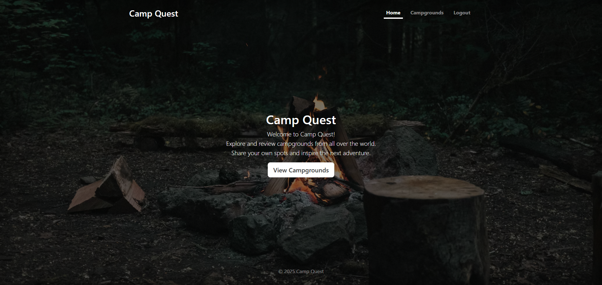

# CampQuest
CampQuest is a full-stack web application inspired by YelpCamp. It allows users to explore, create, and review campgrounds around the world.  
Built using **Node.js**, **Express**, **MongoDB**, and **Bootstrap**.

## Live Demo
[🔗 Visit CampQuest](https://camp-quest-uuy8.onrender.com/)  

## Preview

 
## Features
- Browse campgrounds with detailed descriptions and images  
- Create, edit, and delete your own campgrounds  
- Leave reviews and ratings for other campgrounds  
- Authentication using **Passport.js** (register/login/logout)  
- Location and map integration using **MapTiler**  
- Server-side validation and error handling  
- Fully responsive design (Bootstrap 5)

## Tech Stack
| Category | Technologies |
|-----------|---------------|
| Frontend | EJS, EJS-Mate, Bootstrap, JavaScript |
| Backend | Node.js, Express.js |
| Database | MongoDB with Mongoose |
| Authentication | Passport.js |
| Maps & Geocoding | MapTiler API |
| Validation | JOI |
| Other Tools | Cloudinary (image uploads), Connect-Flash, Helmet, Express-Session |

## Installation & Setup

### 1. Clone the repository
```bash
git clone https://github.com/yourusername/campquest.git
cd campquest
```

### 2. Install dependencies
```bash
npm install
```

### 3. Create a .env file in root directory
```
CLOUDINARY_CLOUD_NAME=your_cloud_name
CLOUDINARY_KEY=your_key
CLOUDINARY_SECRET=your_secret
MAPTILER_API_KEY=your_maptiler_key
DB_URL=mongodb://127.0.0.1:27017/campquest
MONGO_STORE_SECRET=your_secret
EXPRESS_SESSION_SECRET=your_secret
```

### 4. Run the app
```bash
node app.js
```

### 5. Visit
```bash
http://localhost:3000
```

## Seed the Database (optional)
If you want demo data run the seed script:
```bash
node seeds/index.js
```

## Project Structure
```
campquest/
├── models/
│   ├── campground.js
│   ├── review.js
│   └── user.js
├── routes/
│   ├── campgrounds.js
│   ├── reviews.js
│   └── users.js
├── public/
│   ├── css/
│   ├── js/
│   └── images/
├── views/
│   ├── campgrounds/
│   ├── reviews/
│   ├── users/
│   ├── layouts/
│   └── partials/
│   └── users/
├── seeds/
│   └── index.js
├── utils/
│   ├── ExpressError.js
│   └── mongoSanitizeV5.js
├── app.js
└── README.md
└── joiSchemas.js
└── middleware.js
```

## Author
**John Jomar Dimaunahan**
[GitHub](https://github.com/DJohnJomar) <br>
Passionate about web development and backend systems

## Acknowledgements
- [Colt Steele's Web Development Bootcamp](https://www.udemy.com/course/the-web-developer-bootcamp/?srsltid=AfmBOorK0KwH72W7lL3-Md3E3Ef4M64pAa5T9BsCjkzHz5kUuUPUaCr_)
